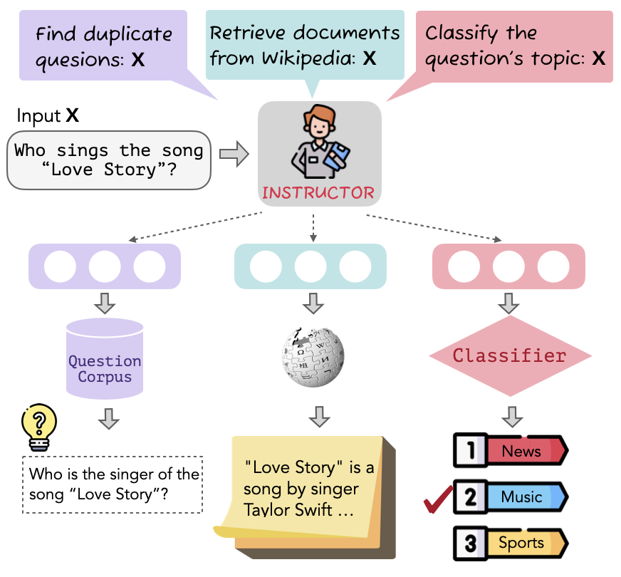

# One Embedder, Any Task: Instruction-Finetuned Text Embeddings

This repository contains the code and pre-trained models for our paper [One Embedder, Any Task: Instruction-Finetuned Text Embeddings](https://github.com/HKUNLP/instructor-embedding). 

We provide a universal encoder, **INSTRUCTOR**, capable of calculating fixed-size embeddings for **any** piece of text (e.g., a title, a sentence, a document, etc.) in test time without further training. With instructions, the embeddings are **customized** for various domains (e.g., science, finance, etc.) and task objectives (e.g., classification, information retrieval, etc.)
<p align="center">
  
</p>

## Installation
We recommend **Python 3.6** or higher. To establish the environment, run this code in the shell:
```bash
conda env create -f instructor_embedding.yml
conda activate instructor
cd transformers
pip install -e .
cd sentence-transformers
pip install -e .
```
That will create the environment INSTRUCTOR we used.

### Environment setup

Activate the environment by running
```bash
conda activate instructor
```

## Getting Started

First download a pretrained model

```python
from sentence_transformers import SentenceTransformer
model = SentenceTransformer('hku-nlp/instructor-large')
```

Then provide the sentence and customized instruction to the model.
```python
# prepare texts with instructions
text_instruction_pairs = [
    {"instruction": "Represent the Science title; Input:", "text": "3D ActionSLAM: wearable person tracking in multi-floor environments"}, 
    {"instruction": "Represent the Medicien sentence for retrieving a duplicate sentence; Input:", "text": "Recent studies have suggested that statins, an established drug group in the prevention of cardiovascular mortality, could delay or prevent breast cancer recurrence but the effect on disease-specific mortality remains unclear."
]

# postprocess
texts_with_instructions = []
for pair in text_instruction_pairs:
    texts_with_instructions.append([pair["instruction"], pair["text"], 0])

# calculate embeddings
customized_embeddings = model.encode(texts_with_instructions)
```

And that's it already. We now have a list of numpy arrays with the emebddings.

```python
for pair, embedding in zip(text_instruction_pairs, customized_embeddings):
    print("Instruction: ", pair["instruction"])
    print("text: ", pair["text"])
    print("Embedding: ", embedding)
    print("")
```

### Calculate embeddings for your customized texts
If you want to calculate customized embeddings for specific sentences, you may follow the unified template to write instructions: 

&nbsp;&nbsp;&nbsp;&nbsp;&nbsp;&nbsp;&nbsp;&nbsp;&nbsp;&nbsp;&nbsp;&nbsp;&nbsp;&nbsp;&nbsp;&nbsp;&nbsp;&nbsp;&nbsp;&nbsp;&nbsp;&nbsp;&nbsp;&nbsp;&nbsp;&nbsp;Represent the `domain` `text_type` for `task_objective`; Input:
* `domain` is optional, and it specifies the domain of the text, e.g., science, finance, medicine, etc.
* `text_type` is required, and it specifies the encoding unit, e.g., sentence, document, paragraph, etc.
* `task_objective` is optional, and it specifies the objective of emebdding, e.g., retrieve a document, classify the sentence, etc.

### Compute similarities between texts
You can use **INSTRUCTOR** to compute similarities between two groups of sentences, with **customized embeddings**.
```python
from sklearn.metrics.pairwise import cosine_similarity
sentences_a = [['Represent the Science sentence; Input: ','Parton energy loss in QCD matter',0], 
               ['Represent the Financial statement; Input: ','The Federal Reserve on Wednesday raised its benchmark interest rate.',0]
sentences_b = [['Represent the Science sentence; Input: ','The Chiral Phase Transition in Dissipative Dynamics', 0],
               ['Represent the Financial statement; Input: ','The funds rose less than 0.5 per cent on Friday',0]
embeddings_a = model.encode(sentences_a)
embeddings_b = model.encode(sentences_b)
similarities = cosine_similarity(embeddings_a,embeddings_b)
```
## Training
### Data
We construct Multitask Embeddings Data
with Instructions (MEDI), consisting of a collection of 330 datasets from [Super-NI](https://arxiv.org/abs/2204.07705)(Super-NaturalInstructions), [sentence-transformer embedding training data](https://huggingface.co/datasets/sentence-transformers/embedding-training-data), and [KILT](https://arxiv.org/abs/2009.02252), spanning a wide range of domains and tasks. The MEDI data is available to be downloaded at [this link](https://drive.google.com/file/d/1dvmDBp095CY5hwIJxcRNaLH7sIwym4ql/view).

### Train INSTRUCTOR
We provide the example script for training INSTRUCTOR. It calls `train.py` and automatically download MEDI data for training (if not downloaded yet).
```python
python train.py --model_name_or_path sentence-transformers/gtr-t5-large --output_dir {output_directory} --cache_dir {cache_directory} --max_source_length 512 --num_train_epochs 10 --save_steps 500 --cl_temperature 0.01 --warmup_ratio 0.1 --learning_rate 2e-5 --overwrite_output_dir
```
We explain the arguments in the following:
* `--model_name_or_path`: Pretrained checkpoints to start with. We support both model id (e.g., `sentence-transformers/gtr-t5-large`, `sentence-transformers/sentence-t5-large`) and checkpoint path (e.g., checkpoint saved by transformers trainer).
* `--cl_temperature`: Temperature for contrastive loss
* `--cache_dir`: The directory to cache downloaded models and data. If you download the training data manually, you should put the data under `--cache_dir`.
* `--output_dir`: The directory to store the trained models(checkpoints) for evaluation. 

All the other arguments are standard `Huggingface's transformers` training arguments, such as `--overwrite_output_dir`, `--num_train_epochs`, `--learning_rate`. For details, refer to [Huggingface transformers](https://github.com/huggingface/transformers) 

## Evalution
We evalute INSTRUCTOR massively on 70 diverse tasks, spanning a wide range of tasks and domains. Specifically, we build our evaluation on three benchmarks, [MTEB](https://huggingface.co/spaces/mteb/leaderboard), [Billboard](https://arxiv.org/abs/2112.04139), and [Prompt Retrieval](https://arxiv.org/abs/2209.01975). We explain the details about running evaluation scripts in the following.
<!-- * MTEB is a comprehensive embedding evaluation benchmark that aims to provide a holistic view of embedding models.  It combines several conventional benchmarks (e.g., BEIR and STS) and spans a wide range of domain-specific datasets, including science, biology, and medicine. 
* Prompt Retrieval tasks aim to retrieve a few in-context learning (i.e., demonstration) examples from annotated examples given a test instance. The embedding model is used to encode all annotated examples and to find the few most similar examples to the test instance based on the cosine similarity. We evalute emebddings by measuring the average performance on the downstream tasks. 
* Billboard applies INSTRUCTOR to automatic evaluations for text generation tasks. Following [Kasai et al. (2022a)](https://arxiv.org/abs/2112.04139), we measure the cosine similarity between the generated text and each reference text and take the maximum similarity score over all references available. We evaluate all embedding models by the Pearson correlation with the human judgments. -->

### MTEB
To evaluate the model performance on MTEB benchmark dataset, run the following command:
```python
cd evalution/MTEB
python examples/evaluate_model.py --model_name hku-nlp/instructor-large --output_dir outputs --task_name ArguAna --result_file results
```
You can evaluate your trained model checkpoints by specifying `--model_name` and run all MTEB datasets by changing `--task_name`. Check [our paper](https://github.com/HKUNLP/instructor-embedding) or [MTEB benchmark](https://huggingface.co/spaces/mteb/leaderboard) for evaluation metrics of all tasks.

### Billboard
To evaluate the model performance on Billboard, run the following command:
```python
cd evaluation/text_evaluation
python main.py --model_name hku-nlp/instructor-large --task mscoco --add_prompt
```
You can evaluate your trained model checkpoints by specifying `--model_name` and run all Billboard datasets by changing `--task`. In all of the three datasets in Billboard, we report the Pearson correlation.

### Prompt Retrieval
To evaluate the model performance on Prompt Retrieval, run the following command:
```python
cd evaluation/prompt_retrieval
python main.py --embedding_model hku-nlp/instructor-large --task rte --model_cache_dir {cache_dir} --output_dir {output_dir}
```
You can evaluate your trained model checkpoints by specifying `--model_name` and run all Billboard datasets by changing `--task`. In order to have a consistent metric, we cast all tasks in Prompt Retrieval into a "text-to-text" format, and report the Rouge-L score.

## Bugs or questions?
If you have any question related to the code or the paper, feel free to email Hongjin (`hjsu@cs.hku.hk`) and Weijia (`swj0419@cs.washington.edu`). Please try to specify the problem with details so we can help you better and quicker.

## Citation
If you find our work helpful, please cite us:

```bibtex
@inproceedings{INSTRUCTOR,
  title={One Embedder, Any Task: Instruction-Finetuned Text Embeddings},
  author={Hongjin Su, Weijia Shi, Jungo Kasai, Yizhong Wang, Yushi Hu, Mari Ostendorf, Wen-tau Yih, Noah A. Smith, Luke Zettlemoyer, Tao Yu},
  url={https://arxiv.org/abs/2212.09741},
  year={2022},
}
```
