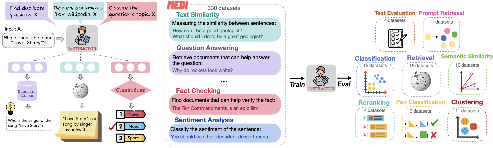

# One Embedder, Any Task: Instruction-Finetuned Text Embeddings

This repository contains the code and pre-trained models for our paper [One Embedder, Any Task: Instruction-Finetuned Text Embeddings](https://arxiv.org/abs/2212.09741). Please refer to our [project page](https://instructor-embedding.github.io/) for a quick project overview.

We introduce **Instructor**👨‍🏫, an instruction-finetuned text embedding model that can generate text embeddings tailored to any task (e.g., classification, retrieval, clustering, text evaluation, etc.) and domains (e.g., science, finance, etc.) ***by simply providing the task instruction, without any finetuning***. Instructor👨‍ achieves sota on 70 diverse embedding tasks!
<p align="center">
  
</p>

## Installation
We recommend Python 3.6 or higher. To establish the environment, run this code in the shell:
```bash
conda env create -f instructor_embedding.yml
conda activate instructor
cd transformers
pip install -e .
cd sentence-transformers
pip install -e .
```
That will create the environment INSTRUCTOR we used.

### Environment setup

Activate the environment by running
```bash
conda activate instructor
```

## Getting Started

First download a pretrained model

```python
from sentence_transformers import SentenceTransformer
model = SentenceTransformer('hkunlp/instructor-large')
```

Then provide the sentence and customized instruction to the model.
```python
# prepare texts with instructions
text_instruction_pairs = [
    {"instruction": "Represent the Science title; Input:", "text": "3D ActionSLAM: wearable person tracking in multi-floor environments"},
    {"instruction": "Represent the Medicien sentence for retrieving a duplicate sentence; Input:", "text": "Recent studies have suggested that statins, an established drug group in the prevention of cardiovascular mortality, could delay or prevent breast cancer recurrence but the effect on disease-specific mortality remains unclear."}
]

# postprocess
texts_with_instructions = []
for pair in text_instruction_pairs:
    texts_with_instructions.append([pair["instruction"], pair["text"], 0])

# calculate embeddings
customized_embeddings = model.encode(texts_with_instructions)
```

And that's it already. We now have a list of numpy arrays with the emebddings.

```python
for pair, embedding in zip(text_instruction_pairs, customized_embeddings):
    print("Instruction: ", pair["instruction"])
    print("text: ", pair["text"])
    print("Embedding: ", embedding)
    print("")
```

## Use cases
We provide a few specific use cases in the following. For more examples and applications, refer to [our paper](https://arxiv.org/abs/2212.09741)
### Calculate embeddings for your customized texts
If you want to calculate customized embeddings for specific sentences, you may follow the unified template to write instructions: 

&nbsp;&nbsp;&nbsp;&nbsp;&nbsp;&nbsp;&nbsp;&nbsp;&nbsp;&nbsp;&nbsp;&nbsp;&nbsp;&nbsp;&nbsp;&nbsp;&nbsp;&nbsp;&nbsp;&nbsp;&nbsp;&nbsp;&nbsp;&nbsp;&nbsp;&nbsp;Represent the `domain` `text_type` for `task_objective`; Input:
* `domain` is optional, and it specifies the domain of the text, e.g., science, finance, medicine, etc.
* `text_type` is required, and it specifies the encoding unit, e.g., sentence, document, paragraph, etc.
* `task_objective` is optional, and it specifies the objective of emebdding, e.g., retrieve a document, classify the sentence, etc.

### Compute similarities between texts
You can use **INSTRUCTOR** to compute similarities between two groups of sentences, with **customized embeddings**.
```python
from sklearn.metrics.pairwise import cosine_similarity
sentences_a = [['Represent the Science sentence; Input: ','Parton energy loss in QCD matter',0], 
               ['Represent the Financial statement; Input: ','The Federal Reserve on Wednesday raised its benchmark interest rate.',0]
sentences_b = [['Represent the Science sentence; Input: ','The Chiral Phase Transition in Dissipative Dynamics', 0],
               ['Represent the Financial statement; Input: ','The funds rose less than 0.5 per cent on Friday',0]
embeddings_a = model.encode(sentences_a)
embeddings_b = model.encode(sentences_b)
similarities = cosine_similarity(embeddings_a,embeddings_b)
```

### Use customized embeddings for information retrieval.
```python
import numpy as np
from sklearn.metrics.pairwise import cosine_similarity
query  = [['Represent the Wikipedia question for retrieving supporting documents; Input: ','where is the food stored in a yam plant',0]]
corpus = [['Represent the Wikipedia document for retrieval; Input: ','Capitalism has been dominant in the Western world since the end of feudalism, but most feel[who?] that the term "mixed economies" more precisely describes most contemporary economies, due to their containing both private-owned and state-owned enterprises. In capitalism, prices determine the demand-supply scale. For example, higher demand for certain goods and services lead to higher prices and lower demand for certain goods lead to lower prices.', 0],
          ['Represent the Wikipedia document for retrieval; Input: ',"The disparate impact theory is especially controversial under the Fair Housing Act because the Act regulates many activities relating to housing, insurance, and mortgage loans—and some scholars have argued that the theory's use under the Fair Housing Act, combined with extensions of the Community Reinvestment Act, contributed to rise of sub-prime lending and the crash of the U.S. housing market and ensuing global economic recession",0],
          ['Represent the Wikipedia document for retrieval; Input: ','Disparate impact in United States labor law refers to practices in employment, housing, and other areas that adversely affect one group of people of a protected characteristic more than another, even though rules applied by employers or landlords are formally neutral. Although the protected classes vary by statute, most federal civil rights laws protect based on race, color, religion, national origin, and sex as protected traits, and some laws include disability status and other traits as well.',0]]
query_embeddings = model.encode(query)
corpus_embeddings = model.encode(corpus)
similarities = cosine_similarity(query_embeddings,corpus_embeddings)
retrieved_doc_id = np.argmax(similarities)
print(retrieved_doc_id)
```

### Use customized embeddings for clustering
```python
import sklearn.cluster
sentences = [['Represent the Medicine sentence for clustering; Input: ','Dynamical Scalar Degree of Freedom in Horava-Lifshitz Gravity', 0],
             ['Represent the Medicine sentence for clustering; Input: ','Comparison of Atmospheric Neutrino Flux Calculations at Low Energies', 0],
             ['Represent the Medicine sentence for clustering; Input: ','Fermion Bags in the Massive Gross-Neveu Model', 0],
             ['Represent the Medicine sentence for clustering; Input: ',"QCD corrections to Associated t-tbar-H production at the Tevatron",0],
             ['Represent the Medicine sentence for clustering; Input: ','A New Analysis of the R Measurements: Resonance Parameters of the Higher,  Vector States of Charmonium',0]]
embeddings = model.encode(sentences)
clustering_model = sklearn.cluster.MiniBatchKMeans(n_clusters=2)
clustering_model.fit(embeddings)
cluster_assignment = clustering_model.labels_
print(cluster_assignment)
```
## Training
### Data
We construct Multitask Embeddings Data
with Instructions (MEDI), consisting of a collection of 330 datasets from [Super-NI](https://arxiv.org/abs/2204.07705)(Super-NaturalInstructions), [sentence-transformer embedding training data](https://huggingface.co/datasets/sentence-transformers/embedding-training-data), and [KILT](https://arxiv.org/abs/2009.02252), spanning a wide range of domains and tasks. We construct positive and negative pairs if they are not provided, and store them in a unified format:
```
{
    [{'query': ['Represent the Amazon title for retrieving relevant reviews; Input: ', 'Like a Jason Bourne in the Space Program!', 0], 'pos': ['Represent the Amazon review for retrieval; Input: ', 'Loved it!  It is Exciting, interesting, and even including information about the space program.', 1], 'neg': ['Represent the Amazon review for retrieval; Input: ', 'If you love Vegemite the way I do, this is the easiest way to obtain it.', 1]}, {'query': ['Represent the Amazon title for retrieving relevant reviews; Input: ', 'Anderson puts it all together', 0], 'pos': ['Represent the Amazon review for retrieval; Input: ', 'Having observed how techology has spawned new enterprises, I find that Anderson puts it all together in a meaningful and understandable tome.  He has found the common thread that will define success and failure in the future.', 1], 'neg': ['Represent the Amazon review for retrieval; Input: ', 'Outstanding device.  Very happy I upgraded.  The flexibility is endless.', 1]}, {'query': ['Represent the Amazon title for retrieving relevant reviews; Input: ', "I haven't really had a chance to use my purchase ...", 0], 'pos': ['Represent the Amazon review for retrieval; Input: ', "I haven't really had a chance to use my purchase, but it appears to be what I was looking for.", 1], 'neg': ['Represent the Amazon review for retrieval; Input: ', 'My new expandable hose works just as advertised after carefully following the first use instructions - adding pressure very gradually to allow the hose to expand slowly the first time!', 1]}, {'query': ['Represent the Amazon title for retrieving relevant reviews; Input: ', 'works cool, easy to implement', 0], 'pos': ['Represent the Amazon review for retrieval; Input: ', 'works cool, easy to implement, fix a door easily from inside, perfect for tenants with landlords who have lease-enabled entry access.', 1], 'neg': ['Represent the Amazon review for retrieval; Input: ', 'Another page turner !  I am going to research other books by this author as I have not read many and I really enjoy his themes and characters as well as the history.', 1]}]
    [{'query': ['Represent the sentence for retrieving duplicate sentences; Input: ', 'An old man with a bag of chips sits with a younger man holding a drink.', 0], 'pos': ['Represent the sentence for retrieving duplicate sentences; Input: ', 'The men have food.', 1], 'neg': ['Represent the sentence for retrieving duplicate sentences; Input: ', 'The men have starved to death.', 1]}, {'query': ['Represent the sentence for retrieving duplicate sentences; Input: ', 'The woman on the left is having her picture taken with another woman who is wearing a tall pink hat.', 0], 'pos': ['Represent the sentence for retrieving duplicate sentences; Input: ', 'Two women are being photographed.', 1], 'neg': ['Represent the sentence for retrieving duplicate sentences; Input: ', 'The woman on the left is taking a picture of the other.', 1]}, {'query': ['Represent the sentence for retrieving duplicate sentences; Input: ', 'Mother and daughter wearing Alice in wonderland customs are posing for a picture.', 0], 'pos': ['Represent the sentence for retrieving duplicate sentences; Input: ', 'Two people are posing for the camera.', 1], 'neg': ['Represent the sentence for retrieving duplicate sentences; Input: ', 'Two people are sleeping at the Disney Castle.', 1]}, {'query': ['Represent the sentence for retrieving duplicate sentences; Input: ', 'A picture of two women with one in lacy white dress with handbag and leggings and the other with a tall red hat, black mid-dress, and frame like plastic dress on top.', 0], 'pos': ['Represent the sentence for retrieving duplicate sentences; Input: ', 'A photo of a couple of females in strange outfits.', 1], 'neg': ['Represent the sentence for retrieving duplicate sentences; Input: ', 'Two females at a bar drinking.', 1]}]
    ...
    [{'query': ['Represent the image caption for retrieving duplicate captions; Input: ', 'Several men standing near a train while other men are walking towards the train. ', 0], 'pos': ['Represent the image caption for retrieving duplicate captions; Input: ', 'A train is on the train tracks while people stand around it.', 1], 'neg': ['Represent the image caption for retrieving duplicate captions; Input: ', "An old toilet that's missing its lid and is vandalized with graffiti.", 1]}, {'query': ['Represent the image caption for retrieving duplicate captions; Input: ', 'A curious cat looking at a yellow bird inside a cage.', 0], 'pos': ['Represent the image caption for retrieving duplicate captions; Input: ', 'A cat near a yellow bird in a cage. ', 1], 'neg': ['Represent the image caption for retrieving duplicate captions; Input: ', 'A giraffe walking through a lush green forest.', 1]}, {'query': ['Represent the image caption for retrieving duplicate captions; Input: ', 'There is a baby elephant all by itself in the cage. ', 0], 'pos': ['Represent the image caption for retrieving duplicate captions; Input: ', 'A small baby elephant biting a rail in a pin.', 1], 'neg': ['Represent the image caption for retrieving duplicate captions; Input: ', 'Books and snacks resting on and around a small table.', 1]}, {'query': ['Represent the image caption for retrieving duplicate captions; Input: ', 'A woman standing on the platform while looking in a train. ', 0], 'pos': ['Represent the image caption for retrieving duplicate captions; Input: ', 'A lady with a luggage cart sticking her head in a train door.', 1], 'neg': ['Represent the image caption for retrieving duplicate captions; Input: ', 'A giraffe that is standing in the grass on a sunny day. ', 1]}]
}
```
The MEDI data is available to be downloaded at [this link](https://drive.google.com/file/d/1dvmDBp095CY5hwIJxcRNaLH7sIwym4ql/view).

### Train INSTRUCTOR
We provide the example script for training INSTRUCTOR. It calls `train.py` and automatically download MEDI data for training (if not downloaded yet).
```python
python train.py --model_name_or_path sentence-transformers/gtr-t5-large --output_dir {output_directory} --cache_dir {cache_directory} --max_source_length 512 --num_train_epochs 10 --save_steps 500 --cl_temperature 0.01 --warmup_ratio 0.1 --learning_rate 2e-5 --overwrite_output_dir
```
We explain the arguments in the following:
* `--model_name_or_path`: Pretrained checkpoints to start with. We support both model id (e.g., `sentence-transformers/gtr-t5-large`, `sentence-transformers/sentence-t5-large`) and checkpoint path (e.g., checkpoint saved by transformers trainer).
* `--cl_temperature`: Temperature for contrastive loss
* `--cache_dir`: The directory to cache downloaded models and data. If you download the training data manually, you should put the data under `--cache_dir`.
* `--output_dir`: The directory to store the trained models(checkpoints) for evaluation. 

All the other arguments are standard `Huggingface's transformers` training arguments, such as `--overwrite_output_dir`, `--num_train_epochs`, `--learning_rate`. For details, refer to [Huggingface transformers](https://github.com/huggingface/transformers) 

## Evalution
We evalute INSTRUCTOR massively on 70 diverse tasks, spanning a wide range of tasks and domains. Specifically, we build our evaluation on three benchmarks, [MTEB](https://huggingface.co/spaces/mteb/leaderboard), [Billboard](https://arxiv.org/abs/2112.04139), and [Prompt Retrieval](https://arxiv.org/abs/2209.01975). We explain the details about running evaluation scripts in the following.
<!-- * MTEB is a comprehensive embedding evaluation benchmark that aims to provide a holistic view of embedding models.  It combines several conventional benchmarks (e.g., BEIR and STS) and spans a wide range of domain-specific datasets, including science, biology, and medicine. 
* Prompt Retrieval tasks aim to retrieve a few in-context learning (i.e., demonstration) examples from annotated examples given a test instance. The embedding model is used to encode all annotated examples and to find the few most similar examples to the test instance based on the cosine similarity. We evalute emebddings by measuring the average performance on the downstream tasks. 
* Billboard applies INSTRUCTOR to automatic evaluations for text generation tasks. Following [Kasai et al. (2022a)](https://arxiv.org/abs/2112.04139), we measure the cosine similarity between the generated text and each reference text and take the maximum similarity score over all references available. We evaluate all embedding models by the Pearson correlation with the human judgments. -->

### MTEB
To evaluate the model performance on MTEB benchmark dataset, run the following command:
```python
cd evalution/MTEB
python examples/evaluate_model.py --model_name hkunlp/instructor-large --output_dir outputs --task_name ArguAna --result_file results
```
You can evaluate your trained model checkpoints by specifying `--model_name` and run all MTEB datasets by changing `--task_name`. Check [our paper](https://arxiv.org/abs/2212.09741) or [MTEB benchmark](https://huggingface.co/spaces/mteb/leaderboard) for evaluation metrics of all tasks.

### Billboard
To evaluate the model performance on Billboard, run the following command:
```python
cd evaluation/text_evaluation
python main.py --model_name hkunlp/instructor-large --task mscoco --add_prompt
```
You can evaluate your trained model checkpoints by specifying `--model_name` and run all Billboard datasets by changing `--task`. In all of the three datasets in Billboard, we report the Pearson correlation.

### Prompt Retrieval
To evaluate the model performance on Prompt Retrieval, run the following command:
```python
cd evaluation/prompt_retrieval
python main.py --embedding_model hkunlp/instructor-large --task rte --model_cache_dir {cache_dir} --output_dir {output_dir}
```
You can evaluate your trained model checkpoints by specifying `--model_name` and run all Billboard datasets by changing `--task`. In order to have a consistent metric, we cast all tasks in Prompt Retrieval into a "text-to-text" format, and report the Rouge-L score.

## Bugs or questions?
If you have any question related to the code or the paper, feel free to email Hongjin (`hjsu@cs.hku.hk`) and Weijia (`swj0419@cs.washington.edu`). Please try to specify the problem with details so we can help you better and quicker.

## Citation
If you find our work helpful, please cite us:

```bibtex
@inproceedings{INSTRUCTOR,
  title={One Embedder, Any Task: Instruction-Finetuned Text Embeddings},
  author={Hongjin Su, Weijia Shi, Jungo Kasai, Yizhong Wang, Yushi Hu, Mari Ostendorf, Wen-tau Yih, Noah A. Smith, Luke Zettlemoyer, Tao Yu},
  url={https://arxiv.org/abs/2212.09741},
  year={2022},
}
```
